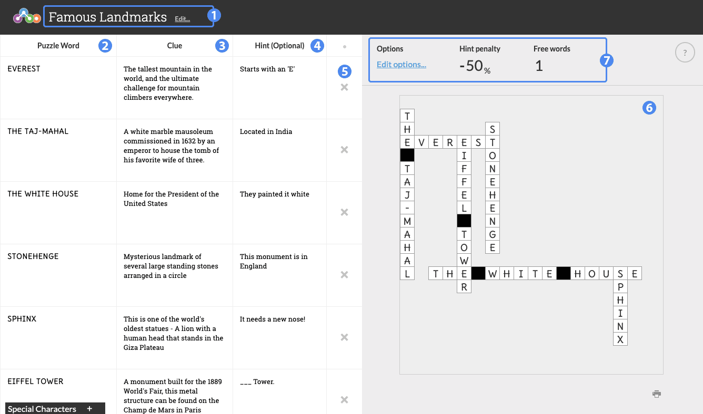

# Overview

Crossword is a quiz tool that uses words and clues to randomly generate a crossword puzzle.

1. Title of the widget
2. Puzzle Word column: enter the word as it will appear in the Crossword puzzle
3. Clue column: enter the word's corresponding clue as it will appear in the clue bank on the right.
4. Hint (Optional) column: enter the optional hint for this word, which will be revealed if the student requests a hint.
5. Delete the current word
6. Crossword puzzle area
7. Options section

## Details

### Word List

To create a crossword puzzle, the widget needs a list of words, clues for those words, and any optional hints that you wish to provide to the students.

#### Generate New Puzzle

The Crossword puzzle will randomly regenerate any time a word is added or changed. You can also mouse over the puzzle at any time and select "Click to redraw puzzle" to randomly regenerate the puzzle. Note that depending on the number and complexity of words, the puzzle may only have a few variations it can cycle between.

If the puzzle area turns red, it means either a word is too long to be properly displayed, or the current combination of words cannot be combined into a puzzle. You will need to adjust the words you are currently using until they are of suitable length and have enough letters in common to be combined.

#### Puzzle Options

You can edit the **Hint penalty** and **Free words** options here. The Hint penalty is incurred for that particular clue (not the total score) if the student selects a hint for it.

A student can request a Free word, penalty-free, up to the Free word limit.
