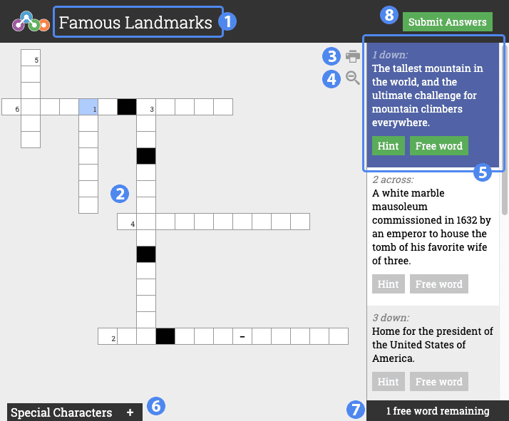

# Overview

Crossword is a quiz tool allowing you to input responses to questions using a Crossword puzzle. You should input your response to each row and column based on the corresponding clue on the right. You can optionally request a hint or receive a free word based on the puzzle's settings.

1. Title of the widget
2. Puzzle area
3. Print puzzle
4. Zoom control
5. Currently selected hint
6. Special character input drawer
7. Free words remaining
8. Finish button

## Details

### Clue Selected State

Selecting a clue will highlight the beginning of the corresponding row or column in the puzzle. You can type the entire word or phrase and use `tab` to advance to the next row or column. You can also use `left arrow` and `right arrow` keys to move the input cursor within a row or column.

**Hint** will provide you with a hint (if hints are provided.) Using a hint also reduces the score for the clue by a certain percentage.

Clicking the **Free Word** button will automatically fill in the word. You are only granted a certain number of free words.

### Special Characters

Some puzzles may require you to input special characters to receive proper credit for a certain character space in a word or phrase. Clicking the Special Character bar at the bottom will expand the tray. You can individually click on any of the special characters to insert them into the currently selected space. You can also use your Operating System's keyboard shortcuts to input special characters.

### Submitting

Clicking **Submit Answers** will submit your puzzle and take you to the score screen to review how you did.
