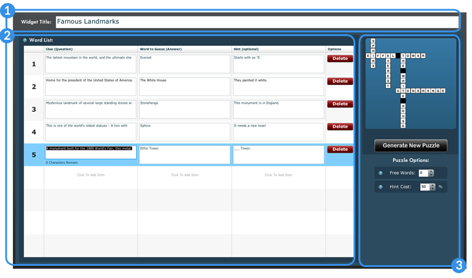

# Overview

Crossword is a quiz tool that uses words and clues to randomly generate a crossword puzzle.

> Annotated Crossword Creator
1. Title of the widget
2. Word List
3. Preview and Options

## Details

### Word List

To create a crossword puzzle, the widget needs a list of words, clues for those words, and any optional hints that you wish to provide to the students.

### Preview and Options

#### Generate New Puzzle

Once a series of words has been entered into the Word List, click the *Generate New Puzzle* button to see a preview of your puzzle.

The *Generate New Puzzle* button will cycle through all available combinations with each click and will attempt to use all of the words in the Word List.

If a word in the Word List cannot be connected by letter to another word, it is omitted from the puzzle.

#### Puzzle Options

The free words option allows students to receive that number of pre-completed words at the start of the game.

The hint will reduce the points associated with a given word if the student chooses to use a hint.
